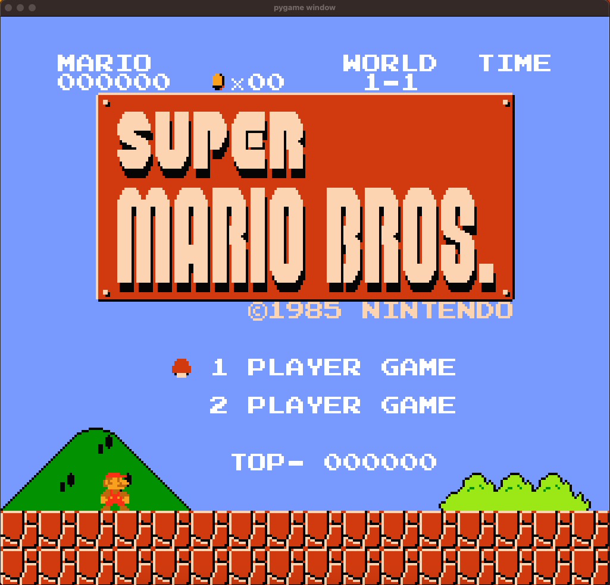
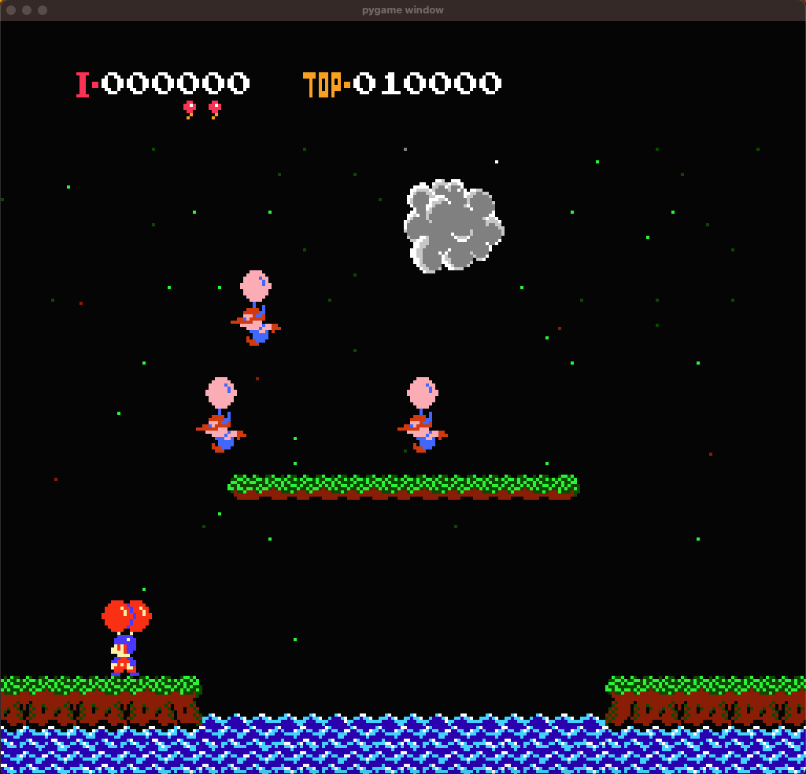
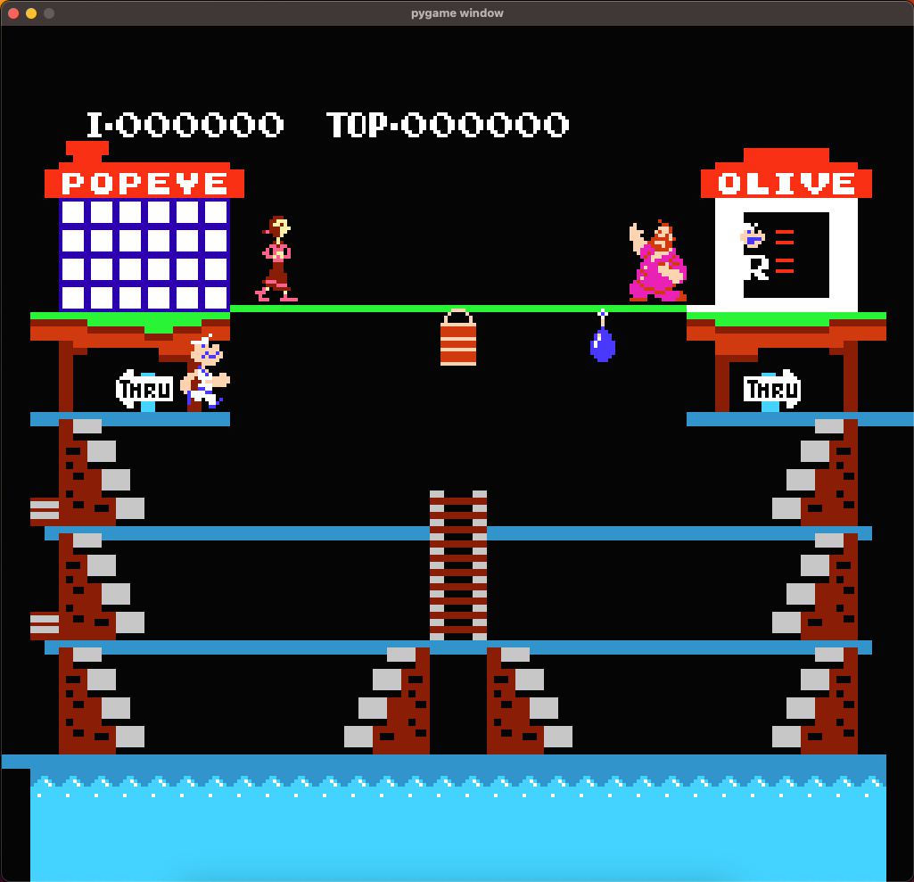
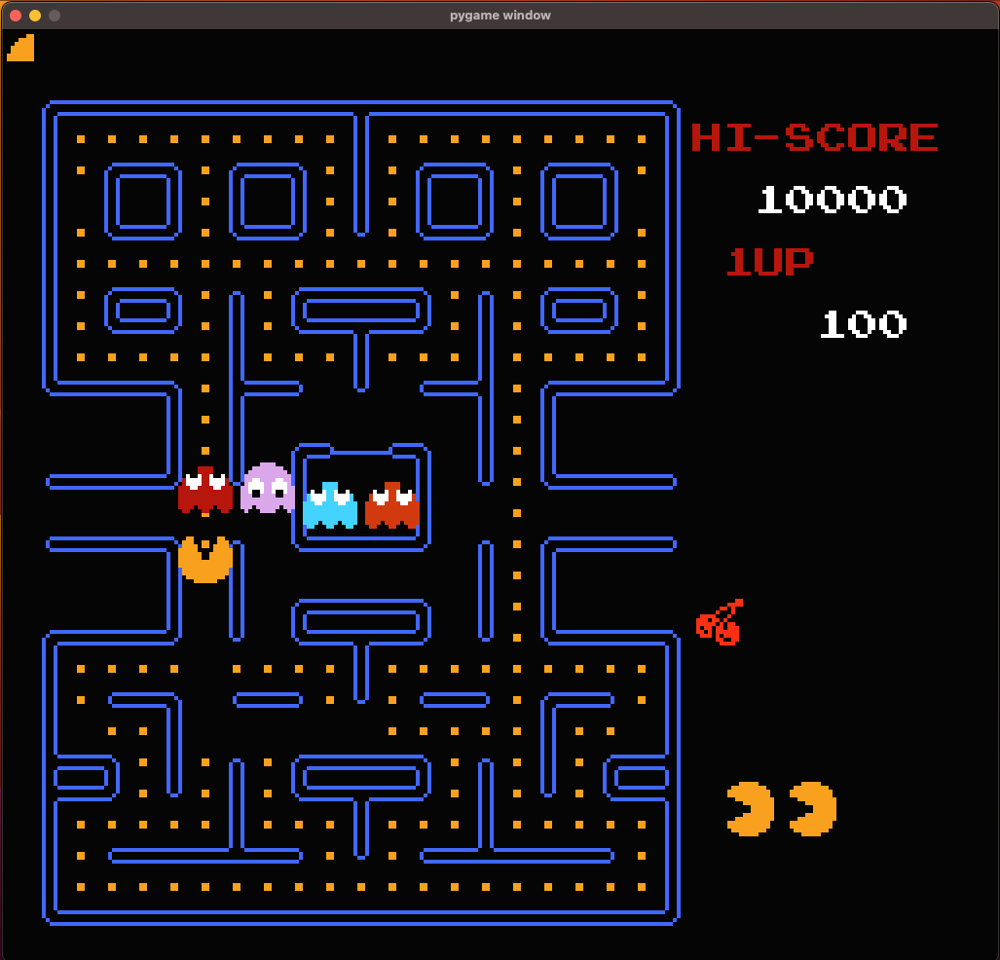

# PyNES
NES Emulator made with Python3 for fun and learning purposes

Made in continuation of PyAndy streams on [Twitch](https://www.twitch.tv/pyandy)

# Recordings that started this code
Recordings of all streams are available on PyAndy's [YouTube](https://www.youtube.com/channel/UCT0oEArSloMLL_URLyy2HfA)

# Current state and what it can do now
- Runs around 15-20 fps

# Next steps
- Fix scrolling
- Try to optimize and see if it can get higher fps

# Tested games:
### No game will be actually playable as this implementation does not aim to emulate the correct speed of a NES
- Super Mario Bros.
  - as scrolling if not working properly, the game is not really playable
  - 
- Balloon Fight
  - seems playable
  - 
- Popeye
  - seems playable
  - 
- Pac-Man
  - as scrolling is not working, title screen is buggy, but game seems playable
  - 

# Useful Links
- [Nesdev Wiki](http://wiki.nesdev.com/w/index.php/Nesdev_Wiki)
- [Online 6502 assembler](https://skilldrick.github.io/easy6502/)
- [6502 Wikipedia page](https://en.wikipedia.org/wiki/MOS_Technology_6502)
- [Nice instruction set page](https://masswerk.at/6502/6502_instruction_set.html)
- [Writing NES Emulator in Rust](https://bugzmanov.github.io/nes_ebook/)